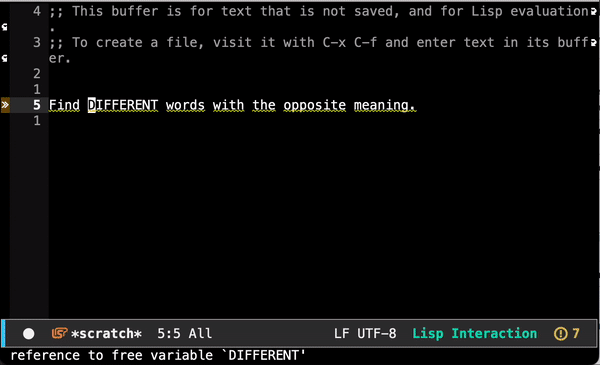

# Thesaurus.el

Emacs package for querying synonyms from [Thesaurus.com](thesaurus.com).
Currently a proof-of-concept.

<p align="center">
    
</p>

## Installation
Clone this repo and add it to your load path:
```elisp
(add-to-list 'load-path "/path/to/this/repo")
```

## Usage
Put your cursor on the word you'd like a synonym for and run `M-x thesaurus-get-synonyms`.
Select a synonym from the completion buffer and hit `RET`.
That's it.


